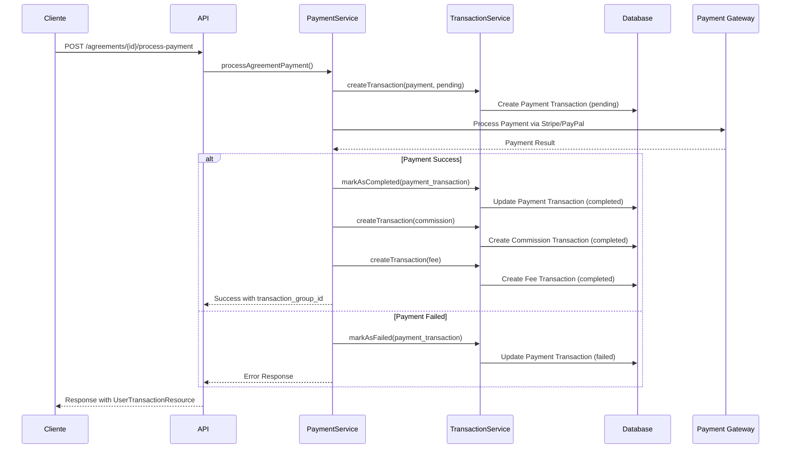
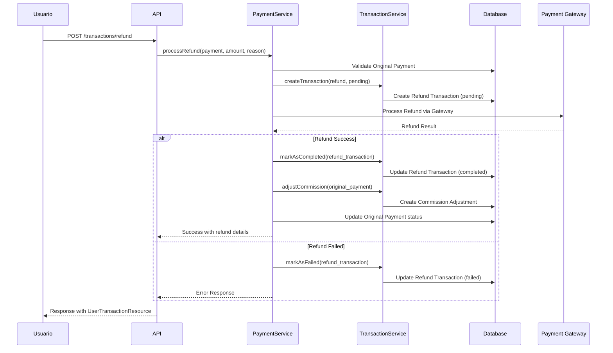
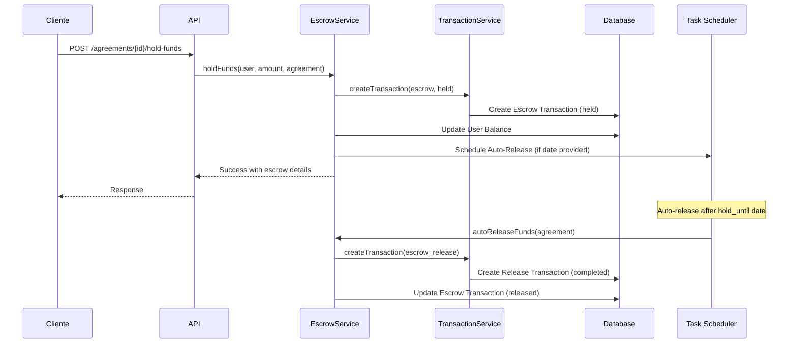
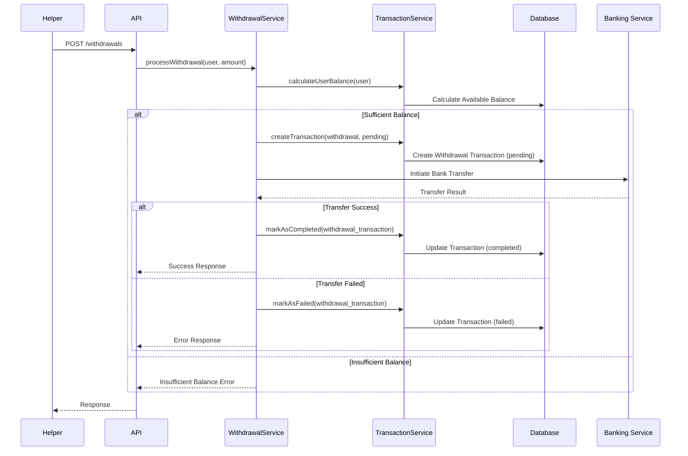

# Sistema de Transacciones - Arquitectura Refactorizada

## Descripción General
El sistema de transacciones ha sido refactorizado para convertir a **Transaction** en la entidad central del sistema financiero. Todos los movimientos financieros (pagos, reembolsos, comisiones, retiros) son ahora tipos de transacciones, proporcionando una arquitectura más coherente y escalable.

## Arquitectura del Sistema

### Entidad Central: Transaction
- **Transaction** es ahora la entidad principal que maneja todos los movimientos financieros
- **Payment** se mantiene como wrapper legacy para compatibilidad hacia atrás
- **Agreement** integra directamente con transacciones
- Nuevos servicios de negocio centralizan la lógica financiera

### Servicios de Negocio
1. **TransactionService**: Lógica central de transacciones
2. **PaymentService**: Manejo específico de pagos
3. **EscrowService**: Gestión de fondos en custodia

### Estructura de la Base de Datos Refactorizada

```sql
CREATE TABLE transactions (
    id BIGINT PRIMARY KEY AUTO_INCREMENT,
    transaction_group_id VARCHAR(255) NOT NULL,
    parent_transaction_id BIGINT NULL,
    user_id BIGINT NOT NULL,
    related_model_type VARCHAR(255) NULL,
    related_model_id BIGINT NULL,
    type ENUM('payment', 'refund', 'withdrawal', 'commission', 'fee', 'adjustment', 'escrow') NOT NULL,
    status ENUM('pending', 'processing', 'completed', 'failed', 'cancelled', 'disputed', 'refunded', 'held', 'released', 'expired') NOT NULL,
    amount DECIMAL(12,2) NOT NULL,
    fee_amount DECIMAL(12,2) DEFAULT 0.00,
    net_amount DECIMAL(12,2) GENERATED ALWAYS AS (amount - fee_amount) STORED,
    currency VARCHAR(3) DEFAULT 'USD',
    payment_method VARCHAR(50) NULL,
    description TEXT NULL,
    reference VARCHAR(255) NULL,
    external_id VARCHAR(255) NULL,
    settlement_date TIMESTAMP NULL,
    risk_score INT DEFAULT 0,
    metadata JSON NULL,
    created_at TIMESTAMP DEFAULT CURRENT_TIMESTAMP,
    updated_at TIMESTAMP DEFAULT CURRENT_TIMESTAMP ON UPDATE CURRENT_TIMESTAMP,
    
    INDEX idx_transaction_group (transaction_group_id),
    INDEX idx_user_type_status (user_id, type, status),
    INDEX idx_parent_transaction (parent_transaction_id),
    INDEX idx_related_model (related_model_type, related_model_id),
    INDEX idx_settlement_date (settlement_date),
    INDEX idx_created_at (created_at),
    
    FOREIGN KEY (user_id) REFERENCES users(id) ON DELETE CASCADE,
    FOREIGN KEY (parent_transaction_id) REFERENCES transactions(id) ON DELETE SET NULL
);
```

## Tipos de Transacciones

### 1. Pagos (payment)
- **Descripción**: Transacciones de pago de clientes a helpers
- **Estados**: pending, processing, completed, failed, cancelled, disputed, refunded
- **Flujo**: Cliente → Plataforma → Helper (menos comisión)
- **Características**:
  - Genera transacciones derivadas (comisión, tarifas)
  - Soporte para pagos parciales
  - Integración con Stripe, PayPal, transferencias bancarias

### 2. Reembolsos (refund)
- **Descripción**: Devolución de dinero al cliente
- **Estados**: pending, processing, completed, failed
- **Flujo**: Helper/Plataforma → Cliente
- **Características**:
  - Vinculado a transacción de pago original
  - Soporte para reembolsos parciales
  - Ajuste automático de comisiones

### 3. Retiros (withdrawal)
- **Descripción**: Retiro de fondos por parte del helper
- **Estados**: pending, processing, completed, failed, cancelled
- **Flujo**: Saldo Helper → Cuenta Bancaria
- **Características**:
  - Validación de saldo disponible
  - Tarifas de procesamiento
  - Integración con sistemas bancarios

### 4. Comisiones (commission)
- **Descripción**: Comisión de la plataforma por transacciones
- **Estados**: completed, cancelled
- **Flujo**: Automático en cada pago
- **Características**:
  - Cálculo automático basado en reglas de negocio
  - Vinculado a transacción de pago principal

### 5. Tarifas (fee)
- **Descripción**: Tarifas adicionales (procesamiento, etc.)
- **Estados**: completed, cancelled
- **Flujo**: Automático según el método de pago
- **Características**:
  - Tarifas variables por método de pago
  - Transparencia total para el usuario

### 6. Ajustes (adjustment)
- **Descripción**: Ajustes manuales de saldo
- **Estados**: completed, cancelled
- **Flujo**: Manual por administradores
- **Características**:
  - Auditoría completa
  - Justificación obligatoria

### 7. Escrow (escrow)
- **Descripción**: Fondos retenidos en custodia
- **Estados**: pending, held, released, expired
- **Flujo**: Cliente → Escrow → Helper (bajo condiciones)
- **Características**:
  - Liberación automática o manual
  - Fechas de vencimiento
  - Protección para ambas partes

### Estados de Transacciones Expandidos

- **Pending**: Transacción creada, esperando procesamiento
- **Processing**: En proceso de ejecución
- **Completed**: Transacción completada exitosamente
- **Failed**: Transacción falló durante el procesamiento
- **Cancelled**: Transacción cancelada por el usuario o sistema
- **Disputed**: En disputa, requiere intervención
- **Refunded**: Transacción reembolsada
- **Held**: Retenida en escrow
- **Released**: Liberada de escrow
- **Expired**: Expirada (para escrow)

## API Endpoints Refactorizados

### Autenticación
Todos los endpoints requieren autenticación mediante Sanctum token:
```
Authorization: Bearer {token}
```

### Transacciones

#### GET /api/transactions
Obtiene el historial de transacciones del usuario autenticado con filtros avanzados.

**Parámetros de consulta:**
- `type`: Filtrar por tipo (payment, refund, withdrawal, commission, fee, adjustment, escrow)
- `status`: Filtrar por estado (pending, processing, completed, failed, cancelled, disputed, refunded, held, released, expired)
- `role`: Filtrar por rol (client, helper)
- `date_from`: Fecha de inicio (YYYY-MM-DD)
- `date_to`: Fecha de fin (YYYY-MM-DD)
- `amount_min`: Monto mínimo
- `amount_max`: Monto máximo
- `search`: Búsqueda en descripción y referencia
- `transaction_group_id`: Filtrar por grupo de transacciones
- `page`: Página actual
- `per_page`: Resultados por página (default: 15, max: 100)

**Respuesta:**
```json
{
  "success": true,
  "data": [
    {
      "id": 1,
      "transaction_group_id": "TXN-GRP-2024-001",
      "parent_transaction_id": null,
      "type": "payment",
      "status": "completed",
      "amount": 50.00,
      "fee_amount": 2.50,
      "net_amount": 47.50,
      "currency": "USD",
      "payment_method": "stripe",
      "description": "Pago por servicio de limpieza",
      "reference": "PAY-2024-001",
      "external_id": "pi_1234567890",
      "formatted_amount": "$50.00",
      "formatted_net_amount": "$47.50",
      "is_positive": false,
      "is_payment": true,
      "is_completed": true,
      "display_info": {
        "title": "Payment Made",
        "subtitle": "Agreement: Servicio de limpieza",
        "icon": "arrow-up-circle",
        "color": "blue"
      },
      "created_at": "2024-01-15T10:30:00Z"
    }
  ],
  "meta": {
    "current_page": 1,
    "last_page": 5,
    "per_page": 15,
    "total": 73
  }
}
```

#### GET /api/transactions/{id}
Obtiene los detalles completos de una transacción específica.

**Respuesta:**
```json
{
  "success": true,
  "data": {
    "id": 1,
    "transaction_group_id": "TXN-GRP-2024-001",
    "parent_transaction_id": null,
    "type": "payment",
    "status": "completed",
    "amount": 50.00,
    "fee_amount": 2.50,
    "net_amount": 47.50,
    "currency": "USD",
    "payment_method": "stripe",
    "description": "Pago por servicio de limpieza",
    "reference": "PAY-2024-001",
    "external_id": "pi_1234567890",
    "settlement_date": "2024-01-16T10:30:00Z",
    "risk_score": 15,
    "metadata": {
      "agreement_id": 123,
      "stripe_payment_intent": "pi_1234567890",
      "commission_rate": 0.15
    },
    "related_model": {
      "type": "Agreement",
      "id": 123,
      "data": {
        "title": "Servicio de limpieza",
        "amount": 50.00,
        "status": "completed"
      }
    },
    "child_transactions": [
      {
        "id": 2,
        "type": "commission",
        "amount": 7.50,
        "status": "completed"
      }
    ],
    "created_at": "2024-01-15T10:30:00Z"
  }
}
```

#### GET /api/transactions/statistics
Obtiene estadísticas de transacciones del usuario.

**Parámetros de consulta:**
- `period`: Período de tiempo (7_days, 30_days, 90_days, 1_year)

**Respuesta:**
```json
{
  "success": true,
  "data": {
    "total_transactions": 45,
    "total_amount": 2250.00,
    "total_fees": 112.50,
    "by_type": {
      "payment": {"count": 20, "amount": 1000.00},
      "refund": {"count": 3, "amount": 150.00},
      "withdrawal": {"count": 5, "amount": 500.00}
    },
    "by_status": {
      "completed": 40,
      "pending": 3,
      "failed": 2
    },
    "monthly_trend": [
      {"month": "2024-01", "amount": 750.00, "count": 15},
      {"month": "2024-02", "amount": 900.00, "count": 18}
    ]
  }
}
```

#### GET /api/transactions/balance
Obtiene el balance actual del usuario.

**Respuesta:**
```json
{
  "success": true,
  "data": {
    "available_balance": 1250.75,
    "pending_balance": 150.00,
    "total_earned": 5000.00,
    "total_spent": 2500.00,
    "total_withdrawn": 1000.00,
    "commission_paid": 249.25
  }
}
```

#### POST /api/transactions/refund
Procesa un reembolso para un pago.

**Cuerpo de la solicitud:**
```json
{
  "payment_id": 123,
  "amount": 25.00,
  "reason": "Servicio parcialmente completado"
}
```

**Respuesta:**
```json
{
  "success": true,
  "message": "Refund processed successfully",
  "data": {
    "refund_transaction": {
      "id": 124,
      "transaction_group_id": "TXN-GRP-2024-002",
      "type": "refund",
      "amount": 25.00,
      "status": "processing"
    },
    "transaction_group_id": "TXN-GRP-2024-002",
    "refunded_amount": 25.00
  }
}
```

#### GET /api/transactions/group/{groupId}
Obtiene todas las transacciones de un grupo específico.

**Respuesta:**
```json
{
  "success": true,
  "data": {
    "group_id": "TXN-GRP-2024-001",
    "transactions": [
      {
        "id": 1,
        "type": "payment",
        "amount": 50.00,
        "status": "completed"
      },
      {
        "id": 2,
        "type": "commission",
        "amount": 7.50,
        "status": "completed"
      }
    ],
    "summary": {
      "total_amount": 57.50,
      "transaction_count": 2,
      "status": "completed",
      "created_at": "2024-01-15T10:30:00Z"
    }
  }
}
```

#### GET /api/transactions/export
Exporta transacciones en diferentes formatos.

**Parámetros de consulta:**
- `format`: Formato de exportación (csv, pdf)
- Mismos filtros que el endpoint de listado

**Respuesta:**
- CSV: Archivo CSV con todas las transacciones
- PDF: Reporte en PDF con resumen y detalles

#### GET /api/transactions/filter-options
Obtiene las opciones disponibles para filtros.

**Respuesta:**
```json
{
  "data": {
    "types": [
      {"value": "payment", "label": "Payment"},
      {"value": "refund", "label": "Refund"},
      {"value": "withdrawal", "label": "Withdrawal"},
      {"value": "commission", "label": "Commission"}
    ],
    "statuses": [
      {"value": "pending", "label": "Pending"},
      {"value": "completed", "label": "Completed"},
      {"value": "failed", "label": "Failed"}
    ],
    "payment_methods": [
      {"value": "stripe", "label": "Credit Card"},
      {"value": "bank_transfer", "label": "Bank Transfer"}
    ]
  }
}
```

### Agreements

#### GET /api/agreements/{id}/financial-summary
Obtiene el resumen financiero de un acuerdo.

**Respuesta:**
```json
{
  "success": true,
  "data": {
    "agreement_id": 123,
    "total_amount": 100.00,
    "total_paid": 100.00,
    "total_refunded": 25.00,
    "net_amount": 75.00,
    "commission_amount": 15.00,
    "helper_earnings": 60.00,
    "payment_status": "partially_refunded",
    "transaction_count": 4,
    "last_transaction_date": "2024-01-20T15:30:00Z"
  }
}
```

#### GET /api/agreements/{id}/transactions
Obtiene todas las transacciones relacionadas con un acuerdo.

**Respuesta:**
```json
{
  "success": true,
  "data": [
    {
      "id": 1,
      "type": "payment",
      "amount": 100.00,
      "status": "completed",
      "created_at": "2024-01-15T10:30:00Z"
    },
    {
      "id": 2,
      "type": "commission",
      "amount": 15.00,
      "status": "completed",
      "created_at": "2024-01-15T10:30:00Z"
    }
  ]
}
```

#### POST /api/agreements/{id}/process-payment
Procesa un pago para un acuerdo.

**Cuerpo de la solicitud:**
```json
{
  "amount": 100.00,
  "payment_method": "stripe",
  "payment_intent_id": "pi_1234567890"
}
```

**Respuesta:**
```json
{
  "success": true,
  "message": "Payment processed successfully",
  "data": {
    "payment_transaction": {
      "id": 1,
      "type": "payment",
      "amount": 100.00,
      "status": "completed"
    },
    "commission_transaction": {
      "id": 2,
      "type": "commission",
      "amount": 15.00,
      "status": "completed"
    },
    "transaction_group_id": "TXN-GRP-2024-001",
    "net_amount_to_helper": 85.00
  }
}
```

#### POST /api/agreements/{id}/hold-funds
Retiene fondos en escrow para un acuerdo.

**Cuerpo de la solicitud:**
```json
{
  "amount": 50.00,
  "hold_until": "2024-02-15T00:00:00Z",
  "reason": "Pending service completion verification"
}
```

#### POST /api/agreements/{id}/release-funds
Libera fondos del escrow.

**Cuerpo de la solicitud:**
```json
{
  "amount": 50.00,
  "reason": "Service completed successfully"
}
```

#### GET /api/agreements/{id}/escrow-balance
Obtiene el balance en escrow para un acuerdo.

**Respuesta:**
```json
{
  "success": true,
  "data": {
    "escrow_balance": 150.00,
    "formatted_balance": "$150.00"
  }
}
```

#### GET /api/agreements/{id}/payment-status
Obtiene el estado de pago de un acuerdo.

**Respuesta:**
```json
{
  "success": true,
  "data": {
    "payment_status": "paid",
    "can_be_paid": false,
    "total_paid": 100.00,
    "total_refunded": 0.00,
    "net_amount": 100.00,
    "commission_amount": 15.00,
    "is_using_transactions": true
  }
}
```

## Flujos de Trabajo Refactorizados

### 1. Procesamiento de Pago de Acuerdo



### 2. Procesamiento de Reembolso



### 3. Gestión de Escrow



### 4. Retiro de Fondos



## Relaciones con Otros Modelos

### User Model
```php
// Relaciones agregadas al modelo User
public function transactions()
{
    return $this->hasMany(Transaction::class);
}

public function clientTransactions()
{
    return $this->transactions()->whereIn('type', ['payment', 'refund', 'fee']);
}

public function helperTransactions()
{
    return $this->transactions()->whereIn('type', ['deposit', 'commission', 'withdrawal']);
}

// Atributos calculados
public function getTotalEarningsAttribute()
{
    return $this->transactions()
        ->whereIn('type', ['deposit', 'bonus'])
        ->where('status', 'completed')
        ->sum('amount');
}
```

### ServiceRequest Model
```php
// Relación agregada al modelo ServiceRequest
public function transactions()
{
    return $this->hasMany(Transaction::class);
}

public function getPaymentStatusAttribute()
{
    $payment = $this->transactions()
        ->where('type', 'payment')
        ->first();
    
    return $payment ? $payment->status : 'unpaid';
}
```

## Seguridad y Validaciones

### Autorización
- Los usuarios solo pueden ver sus propias transacciones
- Los administradores pueden ver todas las transacciones
- Los moderadores pueden ver transacciones para resolución de disputas

### Validaciones
- Montos deben ser positivos
- Referencias deben ser únicas
- Estados deben seguir flujos válidos
- Metadatos deben ser JSON válido

### Auditoría
- Todas las transacciones son inmutables una vez creadas
- Cambios de estado se registran en logs
- Metadatos incluyen información de trazabilidad

## Configuración y Deployment

### Migraciones
```bash
# Ejecutar migración
php artisan migrate

# Ejecutar seeders (incluye datos de prueba)
php artisan db:seed --class=TransactionSeeder
```

### Variables de Entorno
```env
# Configuración de pagos
STRIPE_KEY=pk_test_...
STRIPE_SECRET=sk_test_...
PAYPAL_CLIENT_ID=...
PAYPAL_CLIENT_SECRET=...

# Configuración de comisiones
PLATFORM_COMMISSION_RATE=0.15
WITHDRAWAL_FEE=2.50
```

### Comandos Artisan
```bash
# Procesar transacciones pendientes
php artisan transactions:process-pending

# Generar reportes mensuales
php artisan transactions:monthly-report

# Limpiar transacciones fallidas antiguas
php artisan transactions:cleanup-failed
```

## Testing

### Factory Usage
```php
// Crear transacciones de prueba
$payment = Transaction::factory()->payment()->completed()->create();
$refund = Transaction::factory()->refund()->pending()->create();
$commission = Transaction::factory()->commission()->create();
```

### Casos de Prueba
- Creación de transacciones por tipo
- Validación de estados y transiciones
- Cálculos de comisiones y tarifas
- Autorización de acceso
- Exportación de datos

## Monitoreo y Métricas

### KPIs Importantes
- Volumen total de transacciones
- Tasa de éxito de pagos
- Tiempo promedio de procesamiento
- Comisiones generadas
- Disputas y reembolsos

### Alertas
- Transacciones fallidas por encima del umbral
- Reembolsos excesivos
- Actividad sospechosa
- Problemas de conectividad con gateways

## Ejemplos de Uso

### Ejemplo 1: Pago Completo de Acuerdo

```bash
# 1. Cliente procesa pago por acuerdo
curl -X POST "/api/agreements/123/process-payment" \
  -H "Authorization: Bearer {token}" \
  -H "Content-Type: application/json" \
  -d '{
    "amount": 100.00,
    "payment_method": "stripe",
    "payment_intent_id": "pi_1234567890"
  }'

# Respuesta:
{
  "success": true,
  "message": "Payment processed successfully",
  "data": {
    "payment_transaction": {
      "id": 1,
      "transaction_group_id": "TXN-GRP-2024-001",
      "type": "payment",
      "amount": 100.00,
      "status": "completed"
    },
    "commission_transaction": {
      "id": 2,
      "type": "commission",
      "amount": 15.00,
      "status": "completed"
    },
    "net_amount_to_helper": 85.00
  }
}
```

### Ejemplo 2: Consulta de Transacciones con Filtros

```bash
# Obtener transacciones del último mes con filtros
curl -X GET "/api/transactions?type=payment&status=completed&date_from=2024-01-01&date_to=2024-01-31&per_page=20" \
  -H "Authorization: Bearer {token}"

# Respuesta:
{
  "success": true,
  "data": [
    {
      "id": 1,
      "transaction_group_id": "TXN-GRP-2024-001",
      "type": "payment",
      "status": "completed",
      "amount": 100.00,
      "fee_amount": 2.50,
      "net_amount": 97.50,
      "currency": "USD",
      "payment_method": "stripe",
      "description": "Pago por servicio de limpieza",
      "formatted_amount": "$100.00",
      "is_positive": false,
      "display_info": {
        "title": "Payment Made",
        "subtitle": "Agreement: Servicio de limpieza",
        "icon": "arrow-up-circle",
        "color": "blue"
      },
      "created_at": "2024-01-15T10:30:00Z"
    }
  ],
  "meta": {
    "current_page": 1,
    "last_page": 3,
    "per_page": 20,
    "total": 45
  }
}
```

### Ejemplo 3: Procesamiento de Reembolso Parcial

```bash
# Helper solicita reembolso parcial
curl -X POST "/api/transactions/refund" \
  -H "Authorization: Bearer {token}" \
  -H "Content-Type: application/json" \
  -d '{
    "payment_id": 1,
    "amount": 25.00,
    "reason": "Servicio parcialmente completado"
  }'

# Respuesta:
{
  "success": true,
  "message": "Refund processed successfully",
  "data": {
    "refund_transaction": {
      "id": 3,
      "transaction_group_id": "TXN-GRP-2024-002",
      "parent_transaction_id": 1,
      "type": "refund",
      "amount": 25.00,
      "status": "processing"
    },
    "refunded_amount": 25.00,
    "remaining_amount": 75.00
  }
}
```

### Ejemplo 4: Gestión de Escrow

```bash
# Retener fondos en escrow
curl -X POST "/api/agreements/123/hold-funds" \
  -H "Authorization: Bearer {token}" \
  -H "Content-Type: application/json" \
  -d '{
    "amount": 50.00,
    "hold_until": "2024-02-15T00:00:00Z",
    "reason": "Pending service completion verification"
  }'

# Liberar fondos del escrow
curl -X POST "/api/agreements/123/release-funds" \
  -H "Authorization: Bearer {token}" \
  -H "Content-Type: application/json" \
  -d '{
    "amount": 50.00,
    "reason": "Service completed successfully"
  }'
```

### Ejemplo 5: Consulta de Balance y Estadísticas

```bash
# Obtener balance actual
curl -X GET "/api/transactions/balance" \
  -H "Authorization: Bearer {token}"

# Respuesta:
{
  "success": true,
  "data": {
    "available_balance": 1250.75,
    "pending_balance": 150.00,
    "total_earned": 5000.00,
    "total_spent": 2500.00,
    "total_withdrawn": 1000.00,
    "commission_paid": 249.25
  }
}

# Obtener estadísticas del último mes
curl -X GET "/api/transactions/statistics?period=30_days" \
  -H "Authorization: Bearer {token}"

# Respuesta:
{
  "success": true,
  "data": {
    "total_transactions": 45,
    "total_amount": 2250.00,
    "total_fees": 112.50,
    "by_type": {
      "payment": {"count": 20, "amount": 1000.00},
      "refund": {"count": 3, "amount": 150.00},
      "withdrawal": {"count": 5, "amount": 500.00}
    },
    "by_status": {
      "completed": 40,
      "pending": 3,
      "failed": 2
    }
  }
}
```

## Mejores Prácticas

### Desarrollo
1. **Transacciones de Base de Datos**: Siempre usar transacciones DB para operaciones financieras
2. **Validación**: Validar montos, usuarios y estados antes de procesar
3. **Logging**: Registrar todas las operaciones financieras con detalles completos
4. **Testing**: Implementar tests unitarios y de integración para todos los servicios
5. **Rollback**: Siempre tener estrategias de rollback para operaciones críticas

### Seguridad
1. **Encriptación**: Datos sensibles encriptados en base de datos
2. **Autenticación**: Verificar permisos antes de operaciones financieras
3. **Auditoría**: Mantener logs de auditoría inmutables
4. **Rate Limiting**: Implementar límites de velocidad para APIs críticas
5. **Validación de Entrada**: Sanitizar y validar todos los inputs

### Performance
1. **Índices**: Optimizar consultas con índices apropiados
2. **Cache**: Cachear consultas frecuentes de balance y estadísticas
3. **Paginación**: Implementar paginación en listados de transacciones
4. **Async Processing**: Procesar operaciones pesadas de forma asíncrona
5. **Connection Pooling**: Usar pools de conexión para base de datos

## Consideraciones de Seguridad

### Protección de Datos
- **PCI DSS Compliance**: Cumplir con estándares de seguridad de pagos
- **Encriptación en Tránsito**: HTTPS/TLS para todas las comunicaciones
- **Encriptación en Reposo**: Datos sensibles encriptados en base de datos
- **Tokenización**: Usar tokens en lugar de datos de tarjetas reales

### Control de Acceso
- **Autenticación Multi-Factor**: Para operaciones críticas
- **Principio de Menor Privilegio**: Usuarios solo acceden a lo necesario
- **Segregación de Funciones**: Separar roles de aprobación y ejecución
- **Auditoría de Accesos**: Registrar todos los accesos a datos financieros

### Monitoreo y Alertas
- **Detección de Fraude**: Algoritmos para detectar patrones sospechosos
- **Alertas en Tiempo Real**: Notificaciones para transacciones inusuales
- **Monitoreo de Performance**: Alertas por latencia o errores
- **Backup y Recuperación**: Estrategias de respaldo y recuperación de desastres

## Roadmap Futuro

### Funcionalidades Planificadas
- [ ] Pagos recurrentes automáticos
- [ ] Wallets virtuales para usuarios
- [ ] Integración con más gateways de pago
- [ ] Sistema de disputas automatizado
- [ ] Análisis predictivo de transacciones
- [ ] API webhooks para notificaciones en tiempo real
- [ ] Soporte para criptomonedas
- [ ] Pagos internacionales con conversión automática
- [ ] Sistema de recompensas y cashback
- [ ] Soporte para múltiples monedas

### Mejoras Técnicas
- [ ] Implementación de Event Sourcing
- [ ] Cache distribuido para consultas frecuentes
- [ ] Procesamiento asíncrono de transacciones
- [ ] Backup y recuperación de datos financieros
- [ ] Implementación de Circuit Breaker para gateways
- [ ] Optimización de consultas con índices compuestos
- [ ] Microservicios para escalabilidad
- [ ] Machine Learning para detección de fraude

---

**Última actualización:** Enero 2024  
**Versión:** 1.0  
**Mantenido por:** Equipo de Desarrollo OiDiVi Helper  
**Sistema refactorizado:** Transaction-Centric Architecture